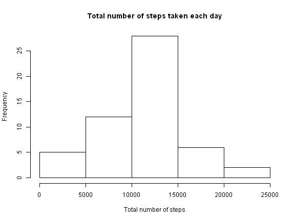
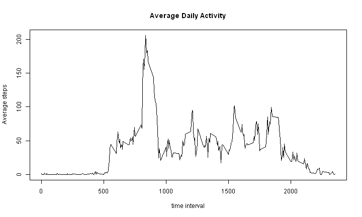
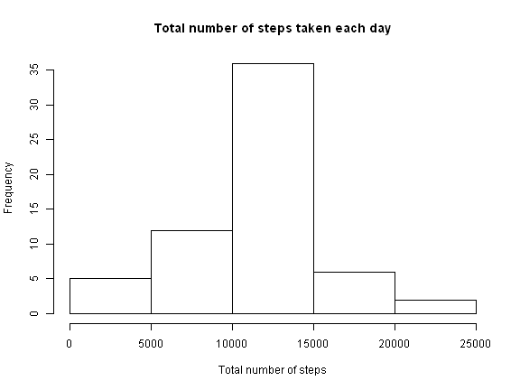
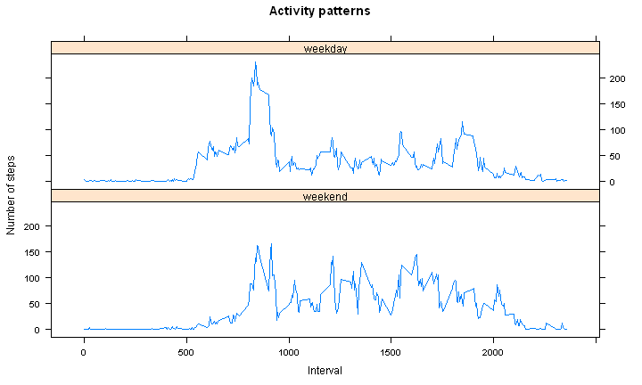

## Loading and preprocessing the data


```r
data<-read.csv("activity.csv",header=TRUE)
head(data)
```

```
##   steps       date interval
## 1    NA 2012-10-01        0
## 2    NA 2012-10-01        5
## 3    NA 2012-10-01       10
## 4    NA 2012-10-01       15
## 5    NA 2012-10-01       20
## 6    NA 2012-10-01       25
```

```r
datanna <- data[!is.na(data$steps),]
```
## What is mean total number of steps taken per day?
### 1. Make a histogram of the total number of steps taken each day


```r
sumStepsByDay <- aggregate(datanna$steps, by=list(date = datanna$date), FUN=sum)
names(sumStepsByDay)[2]<-"steps"
hist(sumStepsByDay$steps,main="Total number of steps taken each day",xlab="Total number of steps")
```

 

### 2.Calculate and report the mean and median total number of steps taken per day

```r
meanSteps<-aggregate(datanna$steps, by=list(date = datanna$date), FUN=function(x) c(mean=mean(x),median=median(x)))

meanSteps
```

```
##          date     x.mean   x.median
## 1  2012-10-02  0.4375000  0.0000000
## 2  2012-10-03 39.4166667  0.0000000
## 3  2012-10-04 42.0694444  0.0000000
## 4  2012-10-05 46.1597222  0.0000000
## 5  2012-10-06 53.5416667  0.0000000
## 6  2012-10-07 38.2465278  0.0000000
## 7  2012-10-09 44.4826389  0.0000000
## 8  2012-10-10 34.3750000  0.0000000
## 9  2012-10-11 35.7777778  0.0000000
## 10 2012-10-12 60.3541667  0.0000000
## 11 2012-10-13 43.1458333  0.0000000
## 12 2012-10-14 52.4236111  0.0000000
## 13 2012-10-15 35.2048611  0.0000000
## 14 2012-10-16 52.3750000  0.0000000
## 15 2012-10-17 46.7083333  0.0000000
## 16 2012-10-18 34.9166667  0.0000000
## 17 2012-10-19 41.0729167  0.0000000
## 18 2012-10-20 36.0937500  0.0000000
## 19 2012-10-21 30.6284722  0.0000000
## 20 2012-10-22 46.7361111  0.0000000
## 21 2012-10-23 30.9652778  0.0000000
## 22 2012-10-24 29.0104167  0.0000000
## 23 2012-10-25  8.6527778  0.0000000
## 24 2012-10-26 23.5347222  0.0000000
## 25 2012-10-27 35.1354167  0.0000000
## 26 2012-10-28 39.7847222  0.0000000
## 27 2012-10-29 17.4236111  0.0000000
## 28 2012-10-30 34.0937500  0.0000000
## 29 2012-10-31 53.5208333  0.0000000
## 30 2012-11-02 36.8055556  0.0000000
## 31 2012-11-03 36.7048611  0.0000000
## 32 2012-11-05 36.2465278  0.0000000
## 33 2012-11-06 28.9375000  0.0000000
## 34 2012-11-07 44.7326389  0.0000000
## 35 2012-11-08 11.1770833  0.0000000
## 36 2012-11-11 43.7777778  0.0000000
## 37 2012-11-12 37.3784722  0.0000000
## 38 2012-11-13 25.4722222  0.0000000
## 39 2012-11-15  0.1423611  0.0000000
## 40 2012-11-16 18.8923611  0.0000000
## 41 2012-11-17 49.7881944  0.0000000
## 42 2012-11-18 52.4652778  0.0000000
## 43 2012-11-19 30.6979167  0.0000000
## 44 2012-11-20 15.5277778  0.0000000
## 45 2012-11-21 44.3993056  0.0000000
## 46 2012-11-22 70.9270833  0.0000000
## 47 2012-11-23 73.5902778  0.0000000
## 48 2012-11-24 50.2708333  0.0000000
## 49 2012-11-25 41.0902778  0.0000000
## 50 2012-11-26 38.7569444  0.0000000
## 51 2012-11-27 47.3819444  0.0000000
## 52 2012-11-28 35.3576389  0.0000000
## 53 2012-11-29 24.4687500  0.0000000
```

## What is the average daily activity pattern?
### 1. Make a time series plot (i.e. type = "l") of the 5-minute interval (x-axis) and the average number of steps taken, averaged across all days (y-axis)

```r
aveStepByTime <- aggregate(datanna$steps, by=list(interval = datanna$interval), FUN=mean)
names(aveStepByTime)[2] <- "ave.steps"
 with(aveStepByTime,plot(interval,ave.steps,main="Average Daily Activity", xlab="time interval", ylab="Average steps"),type="l")
```

 

### 2. Which 5-minute interval, on average across all the days in the dataset, contains the maximum number of steps?

```r
aveStepByTime[order(aveStepByTime$ave.steps,decreasing=T)[1],] 
```

```
##     interval ave.steps
## 104      835  206.1698
```

## Imputing missing values
### 1. Calculate and report the total number of missing values in the dataset (i.e. the total number of rows with NAs)

```r
sum(is.na(data))
```

```
## [1] 2304
```

### 2. Devise a strategy for filling in all of the missing values in the dataset. The strategy does not need to be sophisticated. For example, you could use the mean/median for that day, or the mean for that 5-minute interval, etc.
### 3. Create a new dataset that is equal to the original dataset but with the missing data filled in.


```r
 newData <- data
 
 for ( row in 1:nrow(data)){
  if( is.na(newData[row,'steps']) )
    newData[row,'steps'] <- 
      aveStepByTime[aveStepByTime$interval == data[row,'interval'],'ave.steps']
  
}
```

### 4. Make a histogram of the total number of steps taken each day 

```r
newSumStepsByDay <- aggregate(newData$steps, by=list(date = newData$date), FUN=sum)
names(newSumStepsByDay)[2]<-"steps"
hist(newSumStepsByDay$steps,main="Total number of steps taken each day",xlab="Total number of steps")
```

 
### Calculate and report the mean and median total number of steps taken per day

```r
newMeanSteps<-aggregate(newData$steps, by=list(date = newData$date), FUN=function(x) c(mean=mean(x),median=median(x)))

newMeanSteps
```

```
##          date     x.mean   x.median
## 1  2012-10-01 37.3825996 34.1132075
## 2  2012-10-02  0.4375000  0.0000000
## 3  2012-10-03 39.4166667  0.0000000
## 4  2012-10-04 42.0694444  0.0000000
## 5  2012-10-05 46.1597222  0.0000000
## 6  2012-10-06 53.5416667  0.0000000
## 7  2012-10-07 38.2465278  0.0000000
## 8  2012-10-08 37.3825996 34.1132075
## 9  2012-10-09 44.4826389  0.0000000
## 10 2012-10-10 34.3750000  0.0000000
## 11 2012-10-11 35.7777778  0.0000000
## 12 2012-10-12 60.3541667  0.0000000
## 13 2012-10-13 43.1458333  0.0000000
## 14 2012-10-14 52.4236111  0.0000000
## 15 2012-10-15 35.2048611  0.0000000
## 16 2012-10-16 52.3750000  0.0000000
## 17 2012-10-17 46.7083333  0.0000000
## 18 2012-10-18 34.9166667  0.0000000
## 19 2012-10-19 41.0729167  0.0000000
## 20 2012-10-20 36.0937500  0.0000000
## 21 2012-10-21 30.6284722  0.0000000
## 22 2012-10-22 46.7361111  0.0000000
## 23 2012-10-23 30.9652778  0.0000000
## 24 2012-10-24 29.0104167  0.0000000
## 25 2012-10-25  8.6527778  0.0000000
## 26 2012-10-26 23.5347222  0.0000000
## 27 2012-10-27 35.1354167  0.0000000
## 28 2012-10-28 39.7847222  0.0000000
## 29 2012-10-29 17.4236111  0.0000000
## 30 2012-10-30 34.0937500  0.0000000
## 31 2012-10-31 53.5208333  0.0000000
## 32 2012-11-01 37.3825996 34.1132075
## 33 2012-11-02 36.8055556  0.0000000
## 34 2012-11-03 36.7048611  0.0000000
## 35 2012-11-04 37.3825996 34.1132075
## 36 2012-11-05 36.2465278  0.0000000
## 37 2012-11-06 28.9375000  0.0000000
## 38 2012-11-07 44.7326389  0.0000000
## 39 2012-11-08 11.1770833  0.0000000
## 40 2012-11-09 37.3825996 34.1132075
## 41 2012-11-10 37.3825996 34.1132075
## 42 2012-11-11 43.7777778  0.0000000
## 43 2012-11-12 37.3784722  0.0000000
## 44 2012-11-13 25.4722222  0.0000000
## 45 2012-11-14 37.3825996 34.1132075
## 46 2012-11-15  0.1423611  0.0000000
## 47 2012-11-16 18.8923611  0.0000000
## 48 2012-11-17 49.7881944  0.0000000
## 49 2012-11-18 52.4652778  0.0000000
## 50 2012-11-19 30.6979167  0.0000000
## 51 2012-11-20 15.5277778  0.0000000
## 52 2012-11-21 44.3993056  0.0000000
## 53 2012-11-22 70.9270833  0.0000000
## 54 2012-11-23 73.5902778  0.0000000
## 55 2012-11-24 50.2708333  0.0000000
## 56 2012-11-25 41.0902778  0.0000000
## 57 2012-11-26 38.7569444  0.0000000
## 58 2012-11-27 47.3819444  0.0000000
## 59 2012-11-28 35.3576389  0.0000000
## 60 2012-11-29 24.4687500  0.0000000
## 61 2012-11-30 37.3825996 34.1132075
```
### Do these values differ from the estimates from the first part of the assignment

```r
differ <- merge(newMeanSteps,meanSteps, by= "date" , all.x=TRUE)
differ
```

```
##          date   x.x.mean x.x.median   x.y.mean x.y.median
## 1  2012-10-01 37.3825996 34.1132075         NA         NA
## 2  2012-10-02  0.4375000  0.0000000  0.4375000  0.0000000
## 3  2012-10-03 39.4166667  0.0000000 39.4166667  0.0000000
## 4  2012-10-04 42.0694444  0.0000000 42.0694444  0.0000000
## 5  2012-10-05 46.1597222  0.0000000 46.1597222  0.0000000
## 6  2012-10-06 53.5416667  0.0000000 53.5416667  0.0000000
## 7  2012-10-07 38.2465278  0.0000000 38.2465278  0.0000000
## 8  2012-10-08 37.3825996 34.1132075         NA         NA
## 9  2012-10-09 44.4826389  0.0000000 44.4826389  0.0000000
## 10 2012-10-10 34.3750000  0.0000000 34.3750000  0.0000000
## 11 2012-10-11 35.7777778  0.0000000 35.7777778  0.0000000
## 12 2012-10-12 60.3541667  0.0000000 60.3541667  0.0000000
## 13 2012-10-13 43.1458333  0.0000000 43.1458333  0.0000000
## 14 2012-10-14 52.4236111  0.0000000 52.4236111  0.0000000
## 15 2012-10-15 35.2048611  0.0000000 35.2048611  0.0000000
## 16 2012-10-16 52.3750000  0.0000000 52.3750000  0.0000000
## 17 2012-10-17 46.7083333  0.0000000 46.7083333  0.0000000
## 18 2012-10-18 34.9166667  0.0000000 34.9166667  0.0000000
## 19 2012-10-19 41.0729167  0.0000000 41.0729167  0.0000000
## 20 2012-10-20 36.0937500  0.0000000 36.0937500  0.0000000
## 21 2012-10-21 30.6284722  0.0000000 30.6284722  0.0000000
## 22 2012-10-22 46.7361111  0.0000000 46.7361111  0.0000000
## 23 2012-10-23 30.9652778  0.0000000 30.9652778  0.0000000
## 24 2012-10-24 29.0104167  0.0000000 29.0104167  0.0000000
## 25 2012-10-25  8.6527778  0.0000000  8.6527778  0.0000000
## 26 2012-10-26 23.5347222  0.0000000 23.5347222  0.0000000
## 27 2012-10-27 35.1354167  0.0000000 35.1354167  0.0000000
## 28 2012-10-28 39.7847222  0.0000000 39.7847222  0.0000000
## 29 2012-10-29 17.4236111  0.0000000 17.4236111  0.0000000
## 30 2012-10-30 34.0937500  0.0000000 34.0937500  0.0000000
## 31 2012-10-31 53.5208333  0.0000000 53.5208333  0.0000000
## 32 2012-11-01 37.3825996 34.1132075         NA         NA
## 33 2012-11-02 36.8055556  0.0000000 36.8055556  0.0000000
## 34 2012-11-03 36.7048611  0.0000000 36.7048611  0.0000000
## 35 2012-11-04 37.3825996 34.1132075         NA         NA
## 36 2012-11-05 36.2465278  0.0000000 36.2465278  0.0000000
## 37 2012-11-06 28.9375000  0.0000000 28.9375000  0.0000000
## 38 2012-11-07 44.7326389  0.0000000 44.7326389  0.0000000
## 39 2012-11-08 11.1770833  0.0000000 11.1770833  0.0000000
## 40 2012-11-09 37.3825996 34.1132075         NA         NA
## 41 2012-11-10 37.3825996 34.1132075         NA         NA
## 42 2012-11-11 43.7777778  0.0000000 43.7777778  0.0000000
## 43 2012-11-12 37.3784722  0.0000000 37.3784722  0.0000000
## 44 2012-11-13 25.4722222  0.0000000 25.4722222  0.0000000
## 45 2012-11-14 37.3825996 34.1132075         NA         NA
## 46 2012-11-15  0.1423611  0.0000000  0.1423611  0.0000000
## 47 2012-11-16 18.8923611  0.0000000 18.8923611  0.0000000
## 48 2012-11-17 49.7881944  0.0000000 49.7881944  0.0000000
## 49 2012-11-18 52.4652778  0.0000000 52.4652778  0.0000000
## 50 2012-11-19 30.6979167  0.0000000 30.6979167  0.0000000
## 51 2012-11-20 15.5277778  0.0000000 15.5277778  0.0000000
## 52 2012-11-21 44.3993056  0.0000000 44.3993056  0.0000000
## 53 2012-11-22 70.9270833  0.0000000 70.9270833  0.0000000
## 54 2012-11-23 73.5902778  0.0000000 73.5902778  0.0000000
## 55 2012-11-24 50.2708333  0.0000000 50.2708333  0.0000000
## 56 2012-11-25 41.0902778  0.0000000 41.0902778  0.0000000
## 57 2012-11-26 38.7569444  0.0000000 38.7569444  0.0000000
## 58 2012-11-27 47.3819444  0.0000000 47.3819444  0.0000000
## 59 2012-11-28 35.3576389  0.0000000 35.3576389  0.0000000
## 60 2012-11-29 24.4687500  0.0000000 24.4687500  0.0000000
## 61 2012-11-30 37.3825996 34.1132075         NA         NA
```

## Are there differences in activity patterns between weekdays and weekends?
### 1. Create a new factor variable in the dataset with two levels -- "weekday" and "weekend" indicating whether a given date is a weekday or weekend day.

```r
Sys.setlocale("LC_TIME", "English") 
```

```
## [1] "English_United States.1252"
```

```r
newData['weekdays'] <- sapply(as.Date(newData$date),
                              function(x) if(weekdays(x)== "Sunday" |
                                             weekdays(x)=="Saturday") 0 
                                          else 1 )
```

### 2. Make a panel plot containing a time series plot (i.e. type = "l") of the 5-minute interval (x-axis) and the average number of steps taken, averaged across all weekday days or weekend days (y-axis). 

```r
weekdaysMeanByTime <- aggregate(newData$steps,
                                by=list(interval = newData$interval, 
                                        weekdays = newData$weekdays),
                                FUN=mean)

library(lattice)

with ( weekdaysMeanByTime,
      xyplot(main="Activity patterns",
       x~interval|factor(weekdays,levels=c(0,1),
  	   labels=c("weekend","weekday")) ,
       ylab ="Number of steps",
       xlab = "Interval",
       type = "l",
       layout=c(1,2)
      )
)
```

 


